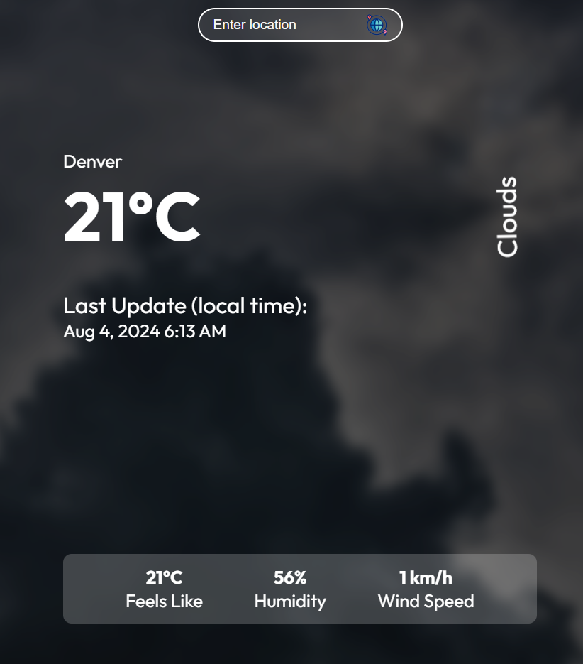

# Weather App



A simple weather application built with React that fetches and displays current weather information for any location using the OpenWeatherMap API. The app dynamically updates the background based on the current weather conditions.

## Features

- **Search for Weather**: Enter a location to fetch and display the current weather.
- **Dynamic Backgrounds**: Changes the background image according to weather conditions like Clear, Clouds, and Rain.
- **Responsive Design**: Optimized for desktop and mobile devices.
- **Loading Indicator**: Displays a loading animation while fetching data.
- **Time Display**: Shows the local time of the searched location.

## Technologies Used

- React
- Axios
- Date-fns
- OpenWeatherMap API
- CSS3

## Getting Started

These instructions will help you set up the project on your local machine for development and testing purposes.

### Prerequisites

- **Node.js**: Ensure you have Node.js installed on your system. You can download it from [nodejs.org](https://nodejs.org/).

- **NPM**: Node.js installation comes with NPM (Node Package Manager). Verify it by running the following command in your terminal:
  ```sh
  npm -v
  ```

### Installation

1. **Clone the Repository**:
   ```sh
   git clone https://github.com/mihnearad/reactive-weather-app.git
   cd weather-app
   ```

2. **Install Dependencies**:
   Run the following command in the project directory to install the necessary dependencies:
   ```sh
   npm install
   ```

3. **API Key Setup**:
   - Obtain an API key from [OpenWeatherMap](https://openweathermap.org/appid) by signing up.
   - Replace the placeholder API key in the code with your actual API key:
     ```javascript
     const url = `https://api.openweathermap.org/data/2.5/weather?q=${location}&units=metric&appid=your-api-key`;
     ```

### Running the App

To start the development server and view the application in your browser, run:

```sh
npm start
```

This command will open the app in your default browser at `http://localhost:3000`.

### Deployment

The app can be deployed to GitHub Pages using the `gh-pages` package.

1. **Build the App**:
   ```sh
   npm run build
   ```

2. **Deploy to GitHub Pages**:
   ```sh
   npm run deploy
   ```

   Ensure the `homepage` field in your `package.json` is set to `https://your-username.github.io/your-repo-name`.

### Project Structure

- `public/`: Contains the `index.html` and static assets.
- `src/`: Contains the main source code for the app.
  - `components/`: Reusable React components.
  - `assets/`: Images and other static assets.
  - `App.js`: Main application component.
  - `index.js`: Entry point for the React app.

### Contributing

Contributions are welcome! Please fork the repository and submit a pull request for any improvements or bug fixes.

### License

This project is licensed under the MIT License - see the [LICENSE](LICENSE) file for details.

### Acknowledgements

- [OpenWeatherMap API](https://openweathermap.org/) for providing the weather data.
- [React](https://reactjs.org/) for the front-end framework.
- [Create React App](https://create-react-app.dev/) for the initial project setup.

---

### Contact

If you have any questions, feel free to reach out to me at contact@mihnea-radulescu.com
